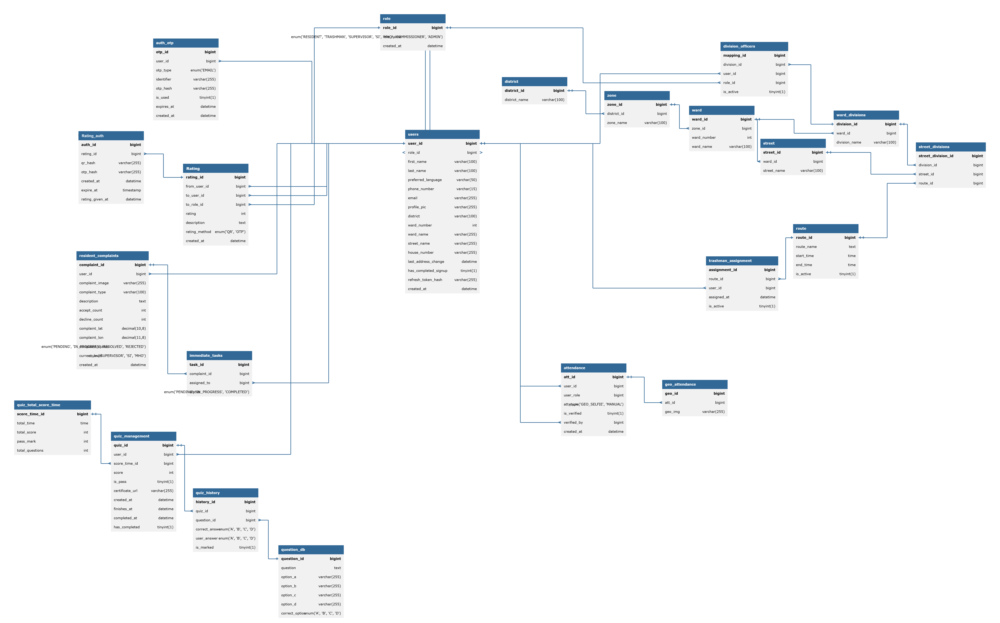

# Database Documentation

Complete technical documentation for the Trash Management SaaS database schema.

---

## Documentation Structure

### Core Documentation

| Document | Description |
|----------|-------------|
| [Overview](overview.md) | Database domains, timezone conventions, entity relationships, security |
| [Architecture](architecture.md) | ERD reference, design principles, data flows, HA topology |
| [Enums](enums.md) | All ENUM types with state machines and validation rules |
| [Performance](performance.md) | Indexing strategies, partitioning, caching, query optimization |

---

## Domain Documentation

| Domain | Description | Key Tables |
|--------|-------------|------------|
| [User Authentication](domains/user-auth.md) | RBAC, passwordless OTP auth, JWT sessions | role, users, auth_otp |
| [Complaints](domains/complaints.md) | 3-tier escalation workflow, task assignment | resident_complaints, immediate_tasks |
| [Routing & Assignment](domains/routing-assignment.md) | 5-tier geographic hierarchy, worker assignments | district→zone→ward→street→route, trashman_assignment |
| [Attendance](domains/attendance.md) | Dual-mode verification (GEO_SELFIE vs MANUAL) | attendance, geo_attendance |
| [Quiz & Certification](domains/quiz-certification.md) | Knowledge assessments, answer immutability | question_db, quiz_management, quiz_history |
| [Rating & Feedback](domains/rating-feedback.md) | QR/OTP verification, resident feedback | rating_auth, rating |

---

## Table Reference

### Authentication & User Management

| Table | Purpose | Relations |
|-------|---------|-----------|
| [role](tables/role.md) | Role definitions (7 static roles) | → users, division_officers |
| [users](tables/users.md) | User accounts (16 columns, 13 child tables) | role ← users → [13 child FKs] |
| [auth_otp](tables/auth_otp.md) | Passwordless authentication (Bcrypt, 10min expiry) | users (no FK - allows pre-registration OTP) |

### Geographic Hierarchy

| Table | Purpose | Relations |
|-------|---------|-----------|
| [Geographic Tables](tables/geographic-hierarchy.md) | 5-tier hierarchy + routing | district → zone → ward → street → route (+ divisions + mappings) |

**Hierarchy Flow:**
```
District → Zone → Ward → Ward Divisions → street_divisions ← Route
                    ↓
                 Street
```

### Worker Management

| Table | Purpose | Relations |
|-------|---------|-----------|
| [trashman_assignment](tables/trashman_assignment.md) | Worker-route assignments (`is_active` flag) | users, route |
| [division_officers](tables/division_officers.md) | Supervisor-division mappings | users, role, ward_divisions |

### Attendance Tracking

| Table | Purpose | Relations |
|-------|---------|-----------|
| [attendance](tables/attendance.md) | Worker attendance records (GEO_SELFIE/MANUAL) | users, verifier |
| [geo_attendance](tables/geo_attendance.md) | Geo-tagged selfies (CASCADE delete) | attendance |

### Complaint Management

| Table | Purpose | Relations |
|-------|---------|-----------|
| [resident_complaints](tables/resident_complaints.md) | Waste collection complaints (3-level escalation) | users, ward_divisions, route |
| [immediate_tasks](tables/immediate_tasks.md) | Tasks from approved complaints | resident_complaints, users |

### Quiz System

| Table | Purpose | Relations |
|-------|---------|-----------|
| [question_db](tables/question_db.md) | Quiz question bank | → quiz_history |
| [quiz_total_score_time](tables/quiz_total_score_time.md) | Quiz configurations (marks, time limit) | → quiz_management |
| [quiz_management](tables/quiz_management.md) | Quiz sessions (coach assigns to student) | users (coach), users (student), quiz_total_score_time |
| [quiz_history](tables/quiz_history.md) | Answer sheet (correct_answer copied for immutability) | quiz_management, question_db |

### Rating & Feedback

| Table | Purpose | Relations |
|-------|---------|-----------|
| [rating_auth](tables/rating_auth.md) | QR/OTP verification sessions (SHA-256/Bcrypt) | users (worker) |
| [rating](tables/rating.md) | Resident ratings (1-5 stars) | rating_auth, users (worker), users (resident) |

---

## Key Design Patterns

### 1. **Timezone Convention**
All `TIMESTAMP` columns store **UTC**. Convert to local time in frontend.

```sql
-- Backend stores UTC
created_at TIMESTAMP DEFAULT CURRENT_TIMESTAMP

-- Frontend displays local
const localTime = new Date(utcTimestamp).toLocaleString();
```

### 2. **Soft Delete Pattern**
Users table supports soft delete for GDPR compliance:
```sql
UPDATE users SET is_active = 0, email = CONCAT(email, '_deleted_', user_id) WHERE user_id = ?;
```

### 3. **Answer Immutability (Quiz)**
`quiz_history.correct_answer` copied from `question_db.correct_option` when quiz starts:
```sql
-- Protects past scores if admin edits question
INSERT INTO quiz_history (quiz_id, question_id, correct_answer)
SELECT ?, question_id, correct_option FROM question_db WHERE question_id IN (...);
```

### 4. **Dual Verification (Rating)**
```sql
-- QR: SHA-256 hash (24h expiry)
qr_hash VARCHAR(255)

-- OTP: Bcrypt hash (10min expiry)
otp_hash VARCHAR(255)
```

### 5. **Cascade Delete**
```sql
-- Geo-attendance auto-deleted if attendance record rejected
CONSTRAINT fk_geo_attendance 
  FOREIGN KEY (att_id) REFERENCES attendance(att_id) 
  ON DELETE CASCADE
```

---

## Performance Best Practices

### Recommended Composite Indexes

```sql
-- Complaint officer dashboard
CREATE INDEX idx_complaint_division_status_level 
ON resident_complaints(division_id, complaint_status, current_level);

-- Worker task queue
CREATE INDEX idx_task_assignee_status 
ON immediate_tasks(assigned_to, status);

-- Attendance verification queue
CREATE INDEX idx_attendance_verification 
ON attendance(is_verified, att_type);

-- Quiz leaderboard
CREATE INDEX idx_quiz_score 
ON quiz_management(score DESC, end_time ASC);
```

### Partitioning Strategies

```sql
-- Time-based partitioning (attendance, complaints, ratings)
ALTER TABLE attendance PARTITION BY RANGE (YEAR(created_at));

-- List-based partitioning (multi-tenancy by district)
ALTER TABLE users PARTITION BY LIST (district_id);
```

See [Performance](performance.md) for complete optimization guide.

---

## Security Considerations

1. **Hash Algorithms:**
   - **Passwords/Refresh Tokens:** Bcrypt (cost=10)
   - **OTP (6-digit):** Bcrypt (protects against brute-force)
   - **QR Tokens (UUID):** SHA-256 (fast verification, low collision risk)

2. **Sensitive Data:**
   - Encrypt: `phone_number`, `email`, `address` (application-layer encryption)
   - Hash: `refresh_token_hash`, `otp_hash`, `qr_hash`

3. **RBAC:**
   - See [Permission Matrix](domains/user-auth.md#permission-matrix)
   - Enforce via `role.middleware.js` + `division_officers` table

4. **Rate Limiting:**
   - OTP: Max 5 requests per 15 minutes per user
   - Quiz: Max 3 attempts per day per student

---

## Relationship Diagram

```
users
  ├── role (parent)
  ├── auth_otp (child, no FK)
  ├── attendance (child as worker)
  ├── attendance (child as verifier)
  ├── trashman_assignment (child)
  ├── resident_complaints (child)
  ├── immediate_tasks (child)
  ├── division_officers (child)
  ├── quiz_management (child as coach)
  ├── quiz_management (child as student)
  ├── rating (child as worker)
  └── rating (child as resident)

ward_divisions
  ├── ward (parent)
  ├── street_divisions (child)
  ├── resident_complaints (child)
  └── division_officers (child)

route
  ├── street_divisions (child)
  ├── trashman_assignment (child)
  └── resident_complaints (child)
```

---

## Quick Reference

### All ENUM Types

| Enum | Values | Used In |
|------|--------|---------|
| `role_name` | RESIDENT, ADMIN, TRASH_MAN, SUPERVISOR, SI, MHO, COMMISSIONER | role.role_name |
| `otp_type` | EMAIL | auth_otp.otp_type |
| `att_type` | GEO_SELFIE, MANUAL | attendance.att_type |
| `complaint_status` | PENDING, IN_PROGRESS, RESOLVED, REJECTED | resident_complaints.complaint_status |
| `current_level` | SUPERVISOR, SI, MHO | resident_complaints.current_level |
| `status` | PENDING, IN_PROGRESS, COMPLETED | immediate_tasks.status |
| `correct_option` | A, B, C, D | question_db.correct_option, quiz_history.correct_answer |
| `user_answer` | A, B, C, D | quiz_history.user_answer |
| `rating_method` | QR, OTP | rating_auth.rating_method |

See [Enums](enums.md) for complete documentation.

---

## Database ERD



**Complete Entity Relationship Diagram** showing all 22 tables, foreign key relationships, and 7 functional domains.

---

## Getting Started

1. **Understand Domains:** Start with [Overview](overview.md) to grasp 7 functional domains
2. **Review Architecture:** See [Architecture](architecture.md) for ERD details and design principles
3. **Dive into Workflows:** Pick a domain:
   - Authentication: [User Auth](domains/user-auth.md)
   - Complaints: [Complaints](domains/complaints.md)
   - Attendance: [Attendance](domains/attendance.md)
   - Quizzes: [Quiz & Certification](domains/quiz-certification.md)
4. **Table Details:** Reference individual tables for schema, queries, indexes
5. **Optimize:** Apply strategies from [Performance](performance.md)

---

## External Resources

- **ERD Diagram:** [Database ERD](assets/database_diagram.png) (high-resolution relationship diagram)
- **Backend API:** [OpenAPI Spec](../api/openapi.yaml) (30 endpoints with Swagger UI at `http://localhost:5000/api-docs`)
- **Frontend Docs:** [Client Documentation](../../../client/docs/) (Docusaurus site at `http://localhost:3000`)

---

## Maintenance

### Schema Versioning
- Track migrations in `server/migrations/` directory
- Use timestamp-based naming: `20240315_add_rating_tables.sql`

### Audit Logging
- Consider adding `updated_at` triggers for critical tables
- Implement change data capture (CDC) for compliance audits

### Backup Strategy
- **Daily:** Full database backup (automated at 2 AM UTC)
- **Hourly:** Incremental binlog backups
- **Retention:** 30 days production, 7 days staging

---

## Support

For schema clarification or migration assistance, refer to:
- Database reference: `server/reference/db.reference`
- Backend architecture: `server/backend.reference`

---

**Last Updated:** 2024  
**Database Version:** MySQL 8.0+ / TiDB Cloud Compatible  
**Documentation Format:** Docusaurus Markdown v2
